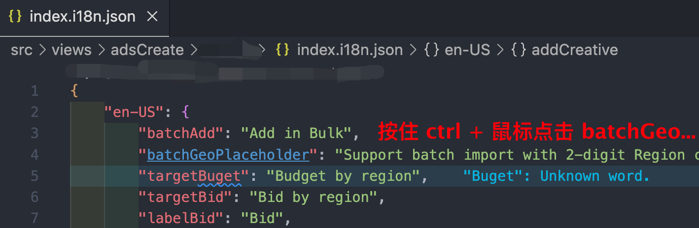
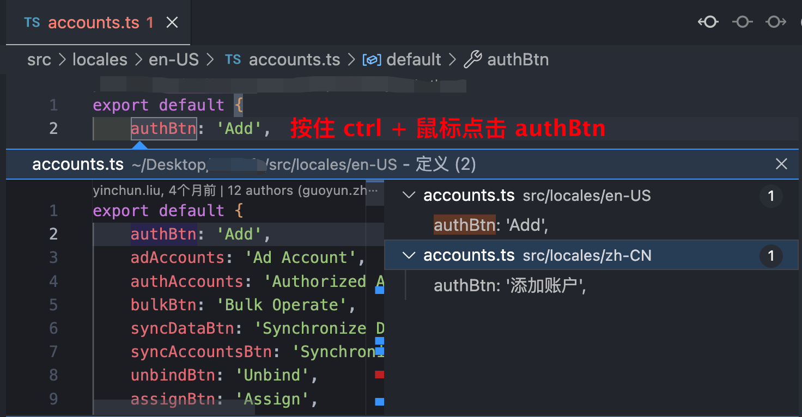
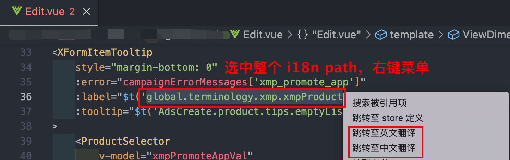
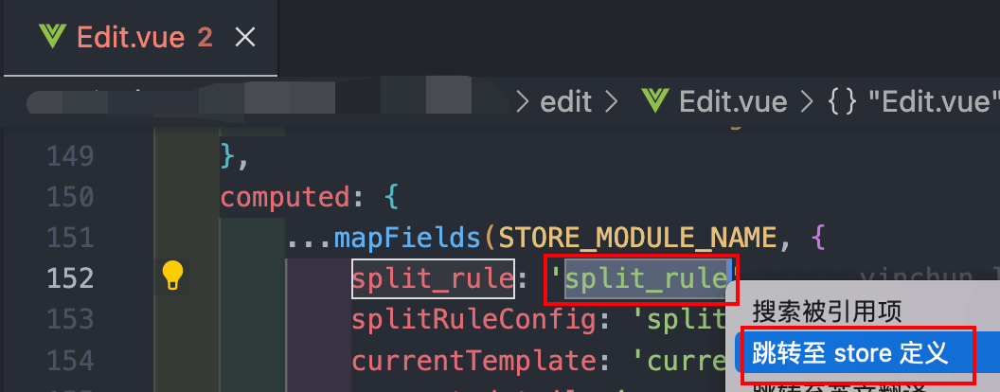
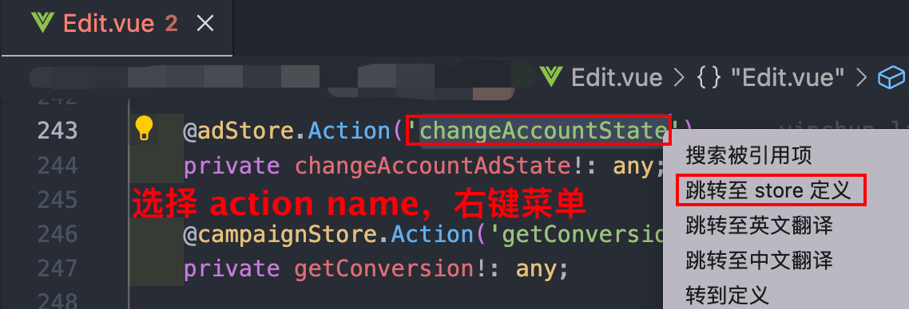

# i18n-jump README
- 在单翻译文件中（xxx.i18n.json），按住 ctrl 点击 key，跳转切换到中英文 key
  

- 在多翻译文件中（src/locales/xxx.ts），按住 ctrl 点击 key，跳转切换到中英文 key
  

- 选中翻译字符串（如$t('component.FilterList.noneOption') 中的 component.FilterList.noneOption），右键菜单第二个，跳转到对应翻译文件
  

- 选中配置文件中的 key（如 NEW_CAMPAIGN: '新建广告系列' 中的 NEW_CAMPAIGN），右键菜单第一个，搜索使用该翻译的引用
  

- 选中 mapFields 中的 key，右键菜单，跳转至 store 定义处。
  

- 选中 Getter，Action，Mutation，State 中的 function name，右键菜单，跳转至 store 定义处。
  

