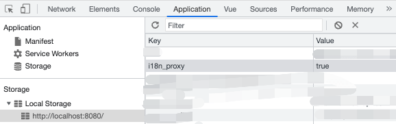

# i18n-jump README
### 中英文快速跳转

- 在单翻译文件中（xxx.i18n.json），按住 ctrl 点击 key，跳转切换到中英文 key
  

- 在多翻译文件中（src/locales/xxx.ts），按住 ctrl 点击 key，跳转切换到中英文 key
  

### 快速跳转至翻译文件

- 选中翻译字符串（如$t('component.FilterList.noneOption') 中的 component.FilterList.noneOption，右键菜单，跳转到对应翻译文件
- 快捷键：shift+alt+2
  

### 快速跳转至 store 定义
- 选中 mapFields 中的 key，右键菜单，跳转至 store 定义处。
- 快捷键：shift+alt+3
  

- 选中 Getter，Action，Mutation，State 中的 function name，右键菜单，跳转至 store 定义处。
- 快捷键：shift+alt+3
  

#### 快速搜索使用该翻译的地方
- 选中配置文件中的 key（如 NEW_CAMPAIGN: '新建广告系列' 中的 NEW_CAMPAIGN），右键菜单第一个，搜索使用该翻译的引用
- 快捷键：shift+alt+1
  

#### 右键文案，开始搜索当前翻译所用翻译路径
- 在页面文案处，点击鼠标右键，触发搜索
  
- vscode 自动定位搜索栏，并将翻译所用路径填充搜索
  
- 在 localStorage 中添加 i18n_proxy 来开启该功能
  
  

